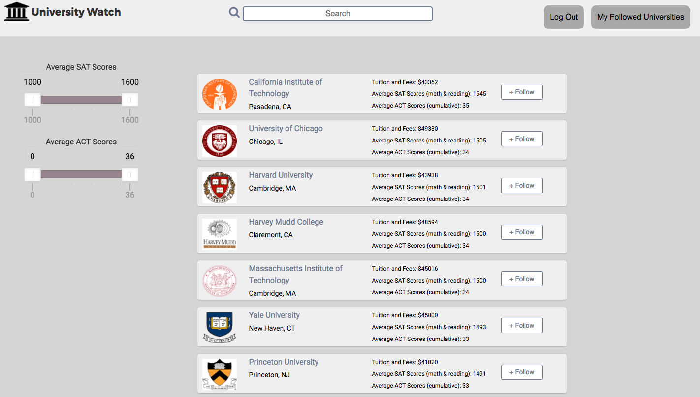
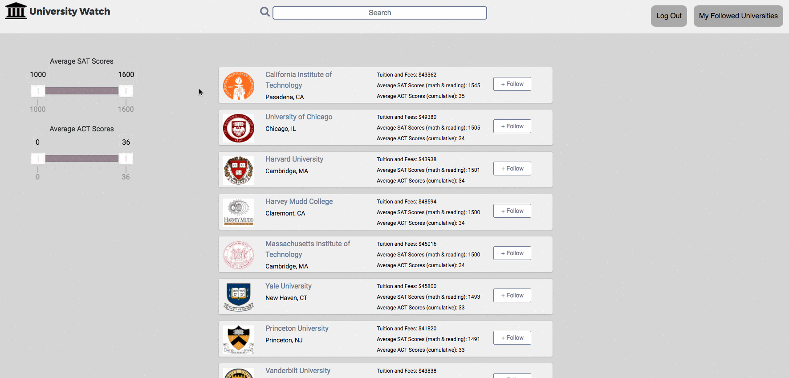

# README

[University Watch live][heroku]

[heroku]: http://www.university-watch.com

University Watch is a full-stack web application that enables students, parents, and researchers to explore and compare data on universities across the country. It utilizes Ruby on Rails on the backend, a PostgreSQL database, React.js with a Redux architectural framework on the frontend.

University data, including admissions rates, standardized test scores, and tuition costs are pulled from the College Scorecard API, maintained by the U.S. Department of Education. News results are provided by the Bing News Search API, and location data from the Google Maps API.

## Features & Implementation

## User Authentication
On the back-end, an encrypted, hashed password is stored in the database (passwords are never saved to the database). On log-in, the provided password is rehashed and compared to the encrypted password in order to verify the log-in.

## University Data Rendering

University data is seeded via the College Scorecard API and stored in one table in the database. University data is selectively requested and rendered on the index page based on the page number, search filters, and selection criteria provided by the user.

The university index page is rendered by a few React components: the UniversityIndex component is the parent component on this page and is also responsible for the slider filters. It passes props to the ReactPaginate, SearchBar, and UniversityItem components, which handle pagination, the search feature, and the rendering of individual universities' data, respectively.

## Slider Filters

The university index can be filtered by test scores through sliders on the left-hand side of the page. The slider input is matched against each UniversityItem's props, filtering out UniversityItems that do not match the criteria.

## Search

The university index can be quickly filtered through the search bar. The string provided to the search bar is stored in state and referenced against university names, returning UniversityItem components whose names match against the search substring.

## Future Directions for the Project

In addition to the currently implemented features, I plan to continue expanding the site's functionality through these additional features.

## Data Visualization

Ultimately, University Watch is a tool for comparing colleges. Future iterations of the site will include charts and graphs to measure the relative costs and admission criteria of different institutions. I plan to use the Recharts library to implement this feature.

## Refined Search Features

Currently, the search bar is only able to search for universities by name. I plan to implement a more robust search feature that will be able to filter universities by data fields, including scores, costs, or admissions rates.
