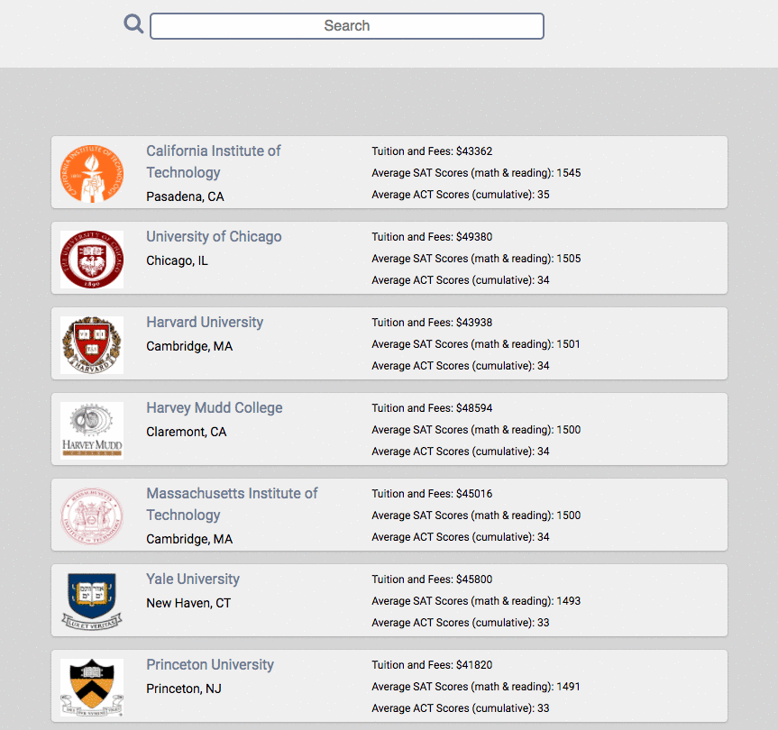

# README

[University Watch live][heroku]

[heroku]: http://www.university-watch.com

University Watch is a full-stack web application that enables students, parents, and researchers to explore and compare data on universities across the country. It utilizes Ruby on Rails on the backend, a PostgreSQL database, React.js with a Redux architectural framework on the frontend.

University data, including admissions rates, standardized test scores, and tuition costs are pulled from the College Scorecard API, maintained by the U.S. Department of Education. News results are provided by the Bing News Search API, and location data from the Google Maps API.

## Features & Implementation

## User Authentication
On the back-end, an encrypted, hashed password is stored in the database (passwords are never saved to the database). On log-in, the provided password is rehashed and compared to the encrypted password in order to verify the log-in.

## University Data Rendering

University data is seeded via the College Scorecard API and stored in one table in the database. University data is selectively requested and rendered on the index page based on the page number, search filters, and selection criteria provided by the user.

The university index page is rendered by a few React components: the UniversityIndex component is the parent component on this page and is also responsible for the slider filters. It passes props to the ReactPaginate, SearchBar, and UniversityItem components, which handle pagination, the search feature, and the rendering of individual universities' data, respectively.

## Slider Filters

## Search

The university index can be quickly filtered through the search bar. The string provided to the search bar is stored in state and referenced against university names, returning UniversityItem components whose names match against the search substring.

The React component structure for notebooks mirrored that of notes: the NotebookIndex component renders a list of CondensedNotebooks as subcomponents, along with one ExpandedNotebook, kept track of by NotebookStore.selectedNotebook().

NotebookIndex render method:

render: function () {
  return ({this.state.notebooks.map(function (notebook) {
    return <CondensedNotebook notebook={notebook} />
  }
  <ExpandedNotebook notebook={this.state.selectedNotebook} />)
}
Tags

As with notebooks, tags are stored in the database through a tag table and a join table. The tag table contains the columns id and tag_name. The tagged_notes table is the associated join table, which contains three columns: id, tag_id, and note_id.

Tags are maintained on the frontend in the TagStore. Because creating, editing, and destroying notes can potentially affect Tag objects, the NoteIndex and the NotebookIndex both listen to the TagStore. It was not necessary to create a Tag component, as tags are simply rendered as part of the individual Note components.

tag screenshot

Future Directions for the Project

In addition to the features already implemented, I plan to continue work on this project. The next steps for FresherNote are outlined below.

Search

Searching notes is a standard feature of Evernote. I plan to utilize the Fuse.js library to create a fuzzy search of notes and notebooks. This search will look go through tags, note titles, notebook titles, and note content.

Direct Messaging

Although this is less essential functionality, I also plan to implement messaging between FresherNote users. To do this, I will use WebRTC so that notifications of messages happens seamlessly.
